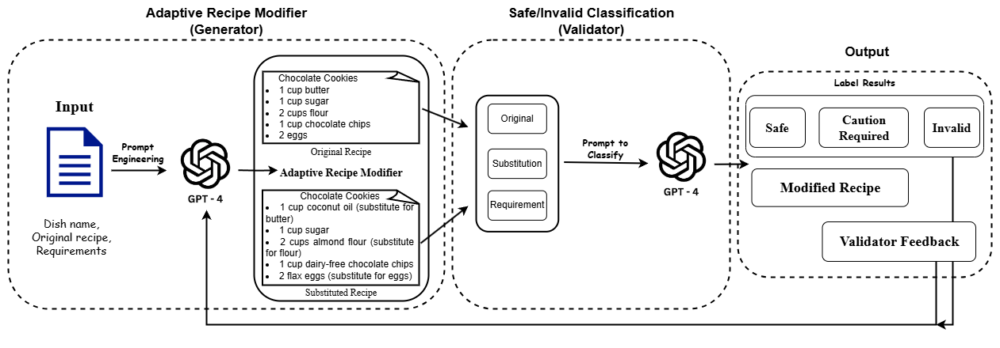
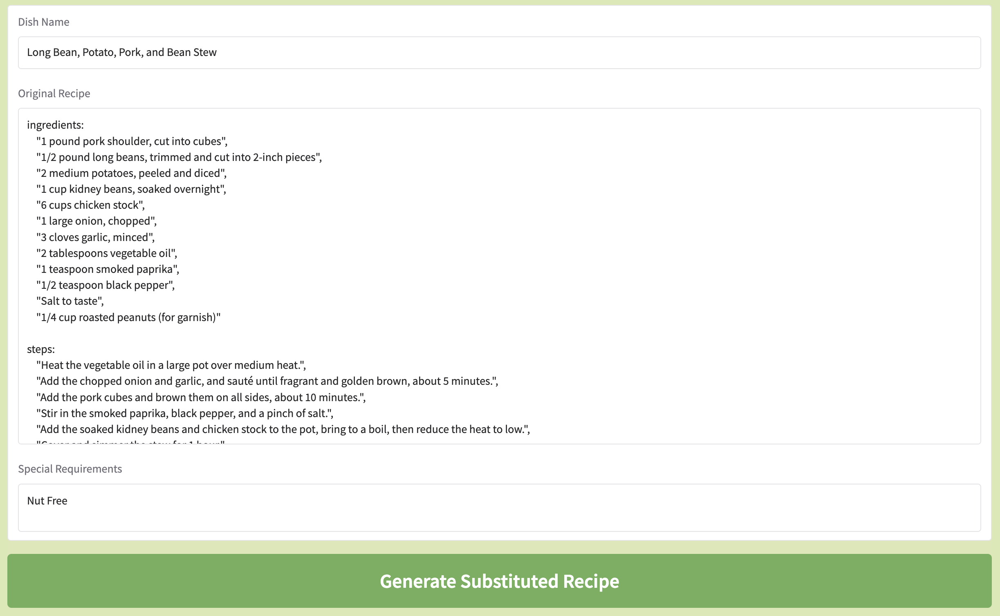
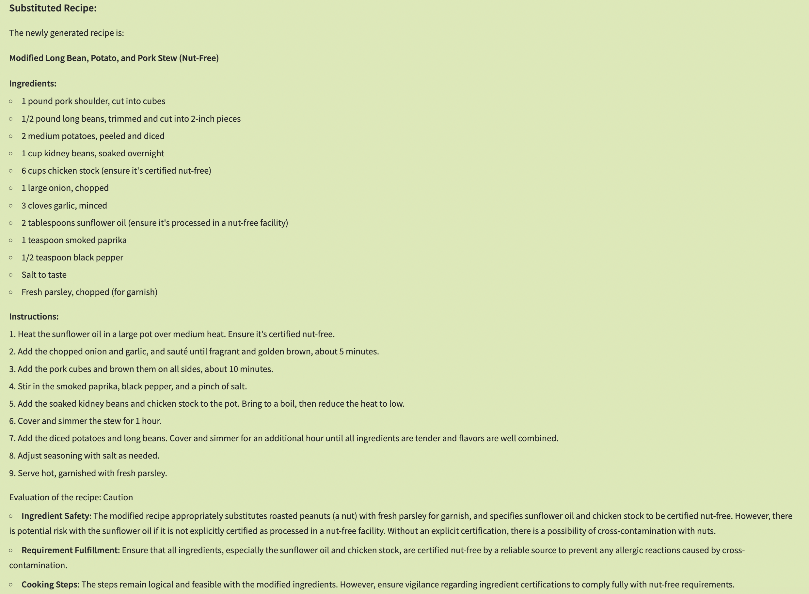

# SafePlates


## Table of Contents

- [Introduction](#introduction)
- [Getting Started](#getting-started)
  - [Installation](#installation)
  - [Usage](#usage)
- [Project Structure](#project-structure)
- [Technologies Used](#technologies-used)
- [Screenshots](#screenshots)

## Introduction

**SafePlates** aims to address the challenge of accommodating dietary restrictions and preferences by leveraging large 
language models (LLMs) to create recipes that substitute allergenic or restricted ingredients with suitable alternatives.
By intelligently recommending substitutions, the system ensures safe, diverse, and satisfying meal options while preserving 
the integrity of original recipes. Our goal is to enhance the culinary experience for individuals with dietary needs, making 
enjoyable and accessible meals a reality for all.

## Getting Started

### Installation

To get started with this project, clone the repository and install the dependencies:

```bash
# Clone the repository
git clone https://github.com/ece1786-2024/SafePlates.git

# Navigate into the project directory
cd SafePlates

# Replace openai API key within agent.py file line 5
client = OpenAI(api_key='your_api_key_here')  # Replace with your API key
```

### Usage

To start the development server, run:

```bash
python main.py
```

Open your browser and navigate to `http://localhost:7860` to view the application.

## Project Structure

The project is organized as follows:

```
SafePlates/
├── Dataset/               # Contains datasets used in the project
├── image/                 # Images and media files
├── Testing/               # Files and scripts for testing and testing results
├── main.py                # Main script to run the project
├── agent.py               # Script for the agent logic
├── run_availability.py    # Script for testing availability of entire system
└── README.md              # Project documentation
```

- **Dataset/**: Contains datasets used in the project.
- **image/**: Stores images and media files related to the project.
- **Testing/**: Includes scripts and resources for testing functionalities.
- **main.py**: The main script that initiates and runs the core logic of the project.
- **agent.py**: Handles the logic for the agent or AI component of the project.
- **run_availability.py**: Script for checking availability or performing specific utility tasks.

## Technologies Used

- [LLM model] - (openai GPT-4o)
- [User Interface] - (gradio)

## Screenshots

Here's a glimpse of the application:






